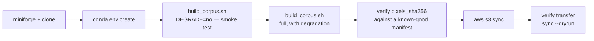

# Building the corpus on a CPU-only AWS host, publishing to S3

**Audience:** whoever runs the build. **Date:** 2026-09-03.

The generator has no GPU path and never had one — inference runs elsewhere and
predictions arrive as files. So a CPU-only instance is not a compromise here, it
is the intended shape of a build host. This runbook is the whole procedure.

Two things that used to make a locked-down host painful are already gone:

- **Augraphy is fully removed.** `grep -rn augraphy generators/ config/` returns
  nothing, and `build_corpus.sh` no longer pip-installs it outside conda — it
  only asserts `import cv2, numpy`. `conda env create -f environment.yml` is now
  the entire setup, which matters where pip-outside-conda is not available.
- **Fonts are vendored** in `fonts/` (Carlito, Liberation), and there is
  deliberately no system-font fallback. Nothing host-provided to install.

`environment.yml` is Pillow, PyYAML, typer, rich, faker, numpy and
opencv-python-**headless**, plus pytest/ruff/mypy. No inference stack.



## 1. Instance setup

conda is a hard requirement: `build_corpus.sh` checks for it on `PATH` and exits
if it is absent.

```bash
curl -L -O https://github.com/conda-forge/miniforge/releases/latest/download/Miniforge3-Linux-x86_64.sh
bash Miniforge3-Linux-x86_64.sh -b -p "$HOME/miniforge3"
eval "$($HOME/miniforge3/bin/conda shell.bash hook)"
conda init bash

gh repo clone tmnestor/document-parsing
cd document-parsing
conda env create -f environment.yml     # ~5 min; the whole setup
```

## 2. Smoke test first

```bash
DEGRADE=no DATE_STAMP=smoke ./build_corpus.sh
```

This validates, generates, serialises, exports and extracts, skipping the
CPU-heavy degradation stage. It proves the environment before you commit to a
long run. Time it — the full build is substantially longer, and this is your
only cheap estimate.

Then clear it away:

```bash
rm -rf ../evaluation_data/corpus_smoke
```

## 3. The full build

```bash
DATE_STAMP=20260902 EVAL_ROOT=$HOME/evaluation_data ./build_corpus.sh
```

**Use the same `DATE_STAMP` as the corpus already being scored.** That is what
makes the output comparable rather than a new vintage. The script refuses to
write into an existing `corpus_$DATE_STAMP`, so it cannot clobber one.

Degradation is the long pole: six tiers over every page, through numpy and
opencv.

`dataset_root` in `config/generation_config.yml` resolves relative to the
**repository root**, not the CWD, so the intermediate render output lands in a
sibling directory of the clone. `EVAL_ROOT` controls only the exported
deliverable.

## 4. Verify the corpus reproduced — check `pixels_sha256`, NOT `sha256`

This is the one step where it is easy to draw the wrong conclusion. Each
manifest row carries three hashes and they answer different questions:

| Hash | Covers | A difference means |
|---|---|---|
| `pixels_sha256` | the decoded pixels | **A different image.** This identifies the page. |
| `sha256` | the image file's bytes | A different *file* — a re-encode or a truncated copy. |
| `transcript_sha256` | the transcript file's bytes | Different ground truth for the same page. |

**`sha256` is expected to differ between machines.** PNG is lossless, but zlib
and zlib-ng emit different bytes from identical pixels. Comparing manifests
byte-for-byte therefore fails spuriously. Compare the pixel and transcript
hashes:

```bash
python -c 'import json,sys
def load(p): return {r["image"]:(r["pixels_sha256"],r["transcript_sha256"]) for r in map(json.loads,open(p))}
a,b=load(sys.argv[1]),load(sys.argv[2])
bad=[k for k in a if a.get(k)!=b.get(k)]
print("IDENTICAL" if a==b and not bad else f"DIFFER on {len(bad)} page(s): {bad[:5]}")' \
  /path/to/known-good/parsing_20260902/manifest.jsonl \
  $HOME/evaluation_data/corpus_20260902/parsing_20260902/manifest.jsonl
```

`IDENTICAL` means this host reproduced the corpus exactly and every prediction
already scored against it stays valid. Repeat per degraded tier for full
coverage.

If it reports `DIFFER`, stop and investigate rather than publishing: a corpus
that does not reproduce invalidates the comparison it exists to support. See
`docs/superpowers/specs/2026-09-01-cross-machine-determinism-design.md` for the
three causes already found and fixed (Pillow's layout engine, platform libm
transcendentals, zlib).

## 5. Publish to S3

```bash
aws s3 sync $HOME/evaluation_data/corpus_20260902 \
            s3://YOUR-BUCKET/corpora/corpus_20260902 --delete
```

**Let it follow the symlink — the default.** `build_corpus.sh` links
`degraded/parsing_<stamp>` to `../parsing_<stamp>` so `matrix.jsonl` can index
the clean baseline as a sibling without duplicating the images.

S3 has no symlinks. Following it materialises those clean images a second time
under `degraded/`, and that duplication is exactly what makes `matrix.jsonl`
resolve for teams reading straight from the bucket. `--no-follow-symlinks`
uploads nothing there and silently breaks the matrix.

Then confirm the transfer arrived intact — which is what the file-byte `sha256`
is for:

```bash
aws s3 sync s3://YOUR-BUCKET/corpora/corpus_20260902 /tmp/check --dryrun
```

Empty output means every object matches what is on disk.

## What consuming teams need

Point them at the `README.md` inside `parsing_<stamp>/`. The exporter writes it,
and it already documents the three-hash discipline, the prompt/transcript
pairing, and the fact that `prompt.md` and `serialisation.yml` ship *with* the
data as a matched set. Scoring against a mismatched vintage is the failure the
manifest exists to make impossible rather than merely detectable.
