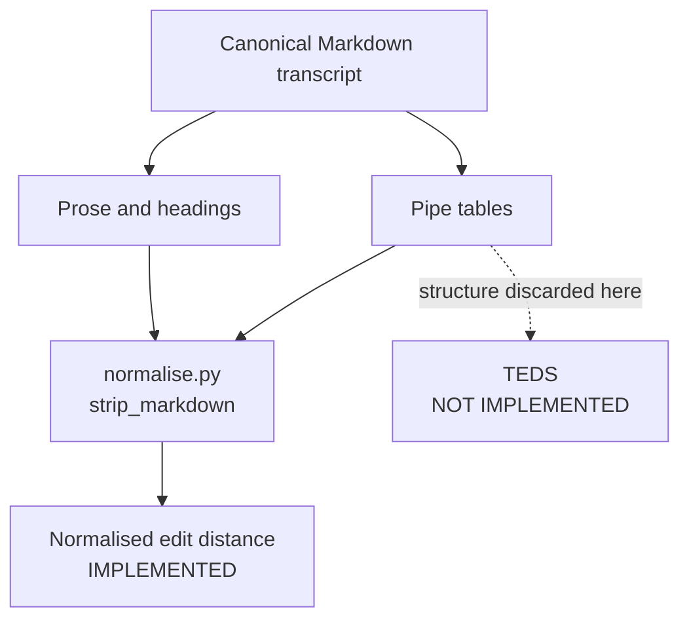

# OmniDocBench, Read Against `document-parsing`

*Notes compiled 2026-08-26. Reflects OmniDocBench v1.7 (April 2026).*
*Written after reading `/Users/tod/Desktop/document-parsing` at that date.*

## Why this benchmark is directly relevant

`document-parsing` generates synthetic Australian business documents, each a page
image paired with a canonical Markdown transcript, to benchmark **full-page
transcription**. That is precisely the task OmniDocBench measures. It is a direct
peer, not an adjacent one, and its metric set is the closest thing to a public
standard for what we are scoring.

Two caveats before reading its leaderboard:

1. It is built by OpenDataLab (Shanghai AI Lab), the same team that builds
   **MinerU**, which runs in our `config/vlm_systems.yml`. OmniDocBench is
   MinerU's home benchmark. Weight MinerU's standing on it accordingly.
2. It is **now widely considered saturated**. GLM-OCR and PaddleOCR-VL-1.5 exceed
   94%; Gemini 3 Pro sits at 90.3%.

## What is in it

| Property | Value |
|---|---|
| Pages | **1,651** real PDF pages (981 at publication, grown via v1.5 and v1.6) |
| Document types | 10: academic papers, financial reports, newspapers, textbooks, handwritten notes, slides, magazines, others |
| Languages | English, Simplified Chinese, mixed |
| Page-level attributes | 5 tags: source, language, layout type, watermark, blur/colour quality |
| Block-level annotations | 28 categories: titles, text blocks, tables, formulas, figures, headers, footers |
| Span-level annotations | 4 categories: text lines, inline formulas, subscripts |

For contrast, our corpus is **165 pages**, 55 cases across invoices, receipts and
bank statements, in 18 layout variants, plus 330 degraded bank-statement pages at
six tiers. Ours is smaller and far narrower by design, and crucially it has
**generated** ground truth rather than hand annotation, which is the thing
OmniDocBench had to pay for by hand.

## Metric coverage, theirs against ours

| Task | OmniDocBench | `scoring/` today |
|---|---|---|
| Text | Normalised edit distance, BLEU, METEOR | **Normalised edit distance (Levenshtein)** |
| Tables | **TEDS**, edit distance | *(none)* |
| Reading order | Edit distance | *(folded into full-page edit distance)* |
| Formulas | CDM, edit distance | not applicable to AU business docs |
| Layout detection | COCO mAP / mAR | not applicable; we score transcripts, not boxes |

## The finding that matters: we are blind to table structure

`scoring/normalise.py` under `policy["strip_markdown"]` substitutes every pipe
character with a space and discards the separator row. Edit distance is then
computed over flattened text.

Our three document types (invoices, receipts, bank statements) are
**table-dominated**. A bank statement is essentially one long table. Under the
current policy, a model that reads every cell value correctly but scrambles the
column assignment can score close to a model that got the structure right,
because once the pipes become spaces the tokens are largely the same tokens.

Edit distance measures whether the characters arrived. It cannot measure whether
they arrived in the right cell. That is the exact gap TEDS was designed to fill,
and it is why OmniDocBench carries both.

### Verified, 2026-08-26

Probe run against the real corpus, `CASE002_bank_statements.md` (3,030 chars),
using the repo's own `scoring.normalise` and `scoring.metrics` with the shipped
`config/scoring.yml` policy. Every amount in the Debits column was moved to the
Credits column, which on a bank statement is a **sign error on every
transaction**: 27 rows changed.

| Perturbation | normalised CER | normalised WER | strict CER |
|---|---|---|---|
| **27 amounts misfiled Debits to Credits** | **0.000000** | **0.000000** | 0.053465 |
| One-character typo (`FORWARD` to `FORWORD`) | 0.000401 | 0.002825 | 0.000330 |

The normalised metric scores 27 reversed transactions as **a perfect
transcription**, exactly zero error, while penalising a single mistyped letter.
It is not that the misfile is under-weighted; it is invisible.

The mechanism is the empty cell. A debit row carries an empty Credits cell, so
once `_PIPES.sub(" ", ...)` runs and whitespace collapses, `$590.52 |` and
`| $590.52` reduce to the same token stream. Nothing distinguishes them.

**Strict does see it**, at 0.053465, about 160x the typo. So the benchmark as a
whole is not blind. But strict cannot say *what* it saw: a misfiled amount and a
model that merely formats its pipe tables differently both show up as markup
divergence. Strict conflates a sign error with a style preference, which is why
its signal cannot be acted on.

## Recommendation: add a structural metric

Two options, and they are complementary rather than alternatives.

**Option 1, and the stronger one for us: a cell-aligned table metric.** Because
our ground truth is *generated*, we know the canonical table structure exactly.
That is a luxury OmniDocBench does not have, and it means we do not need tree
edit distance to recover alignment. Parse both sides into rows and columns, align
rows, then compare cell (i, j) against cell (i, j). A misfiled amount is then
reported as what it is: right value, wrong column. This is the diagnostic metric,
it is cheap, and it directly names the failure the probe above exposed.

**Option 2: TEDS, for comparability.** Structure-only or full TEDS on the
unflattened Markdown converted to HTML. Less diagnostic than cell alignment, but
it is what the public leaderboards report, so it makes our numbers legible to
outsiders.

Either way, **report alongside the existing edit distances, not instead of
them.** Normalised CER measures reading, strict measures markup adherence, and a
structural metric measures placement. Three questions, three numbers.

**Where.** In `docparse-score`, not `docparse`. That boundary is already
established and enforced by `tests/scoring/test_boundaries.py`: the generator
stays at five pure-Python dependencies, while the scoring environment is already
permitted to carry an edit-distance library. A tree-edit-distance library belongs
on the same side of that line. No inference stack, so it still runs on the laptop.

**Licensing.** OmniDocBench's harness is **Apache-2.0**, so its TEDS
implementation can be lifted directly and cleanly. Prefer that over
PubTabNet-derived code, whose provenance is muddier. The underlying algorithm
package (`apted`) needs its licence confirmed before it goes in
`environment-score.yml`.

**Dataset licence, separately.** OmniDocBench's *pages* are **research-only**,
publicly sourced PDFs with restricted content removed. The harness is reusable;
the pages are not, and must not end up in a PROD deliverable on the strength of
a README summary. Our corpus being fully synthetic is a genuine advantage here
and worth stating explicitly whenever this work is compared to public benchmarks.

## Secondary observations

**Reading order is currently conflated with content.** OmniDocBench scores it
separately for a reason. Our single full-page edit distance cannot distinguish
"transcribed the wrong words" from "transcribed the right words in the wrong
order". Given fixed layouts and generated ground truth, a separate order metric
would be cheap.

**We have already hit the saturation problem OmniDocBench is being criticised
for.** `make_degraded_statements.sh` records it directly: receipts have every
gemma checkpoint misfiling zero, invoices are near-saturated, so only bank
statements are degraded. That is the same ceiling effect, discovered
independently, and it is the strongest argument for the degradation tiers being
the axis where the benchmark keeps its discriminating power.

**Confirm degradation tier reaches the scorer as a group key.** `aggregate()`
takes an arbitrary `group_by` tuple, and `corpus.py` shows `case_id` and
`doc_type` on the row. If tier is not a first-class row field, the six-tier
degradation study cannot be sliced by tier in `report.py` without extra work.
Not verified either way in these notes.

**Comparability is a real benefit.** Matching OmniDocBench's metric names and
definitions (normalised edit distance plus TEDS) makes our numbers legible to
anyone who knows the public leaderboards, without adopting its data.

## Sources

- [opendatalab/OmniDocBench (GitHub)](https://github.com/opendatalab/OmniDocBench)
- [OmniDocBench paper, arXiv:2412.07626](https://arxiv.org/abs/2412.07626)
- [OmniDocBench is Saturated, What's Next for OCR Benchmarks? (LlamaIndex)](https://www.llamaindex.ai/blog/omnidocbench-is-saturated-what-s-next-for-ocr-benchmarks)
