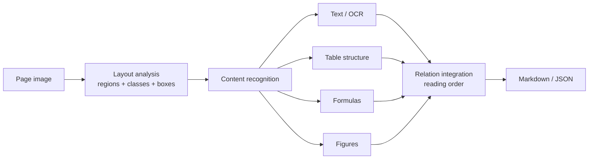

# What "Document Parsing" Actually Means

**Status:** research note, 2026-08-25
**Question:** this repository is called `document-parsing` and ships a corpus for
"full-page transcription". Are those the same thing? What does the field mean by
the term?

**Short answer:** no, and the term is contested. "Document parsing" has a dominant
research meaning that is *wider* than what this corpus measures, and a commercial
meaning that is nearly the *opposite* of it. What this corpus does has a name in
the literature, and that name is not "parsing" — it is **transcription** or
**linearization**.

---

## 1. Why this matters here

Three specific reasons, not pedantry.

1. **The corpus is consumed by a separate scoring repo.** The interface is the
   exported directory, so the only thing carrying intent across that boundary is
   the vocabulary in the README and `prompt.md`. A reader who imports the wrong
   sense of the term will score the wrong thing.
2. **The document types invite the wrong sense.** Invoices, receipts and bank
   statements are precisely the corpus that commercial "document parsing" vendors
   sell against — where the term means field extraction, which §2 of the design
   explicitly puts out of scope.
3. **Both senses already exist inside this project family.**
   `config/generation_config.yml` refers to "the extraction benchmark, not
   transcription" as a separate deliverable. Two neighbouring repos using one word
   for two tasks is exactly the drift the design's §6.1 warns about.

---

## 2. Sense 1 — the research meaning (dominant since ~2024)

The survey that consolidated the field defines it directly:

> "Document parsing (DP), also known as **document content extraction**, has
> emerged as an essential tool for converting unstructured and semi-structured
> documents into structured information."
>
> It "recognizes and extracts various elements such as text, equations, tables,
> and images from various document inputs **while preserving their structural
> relationships**." The output is "transformed into structured formats like
> Markdown or JSON."
>
> — Zhang et al., *Document Parsing Unveiled* ([arXiv:2410.21169](https://arxiv.org/abs/2410.21169))

Two things in that definition do work. "Document content extraction" is offered as
a **synonym**, so the term is not primarily about syntax in the compiler sense.
And "preserving their structural relationships" is the load-bearing clause: parsing
is not just reading the glyphs, it is recovering the document's structure.

### 2.1 The canonical pipeline

The survey organises the field as a modular pipeline (with unified VLMs as the
alternative to it), and reading order is an explicit stage:

> "Rule-based systems or specialized reading order models are commonly applied to
> maintain the logical flow of content."



**Every stage before the output is out of scope for this corpus.** That is the
whole finding of this note.

### 2.2 The benchmark that operationalises it

[OmniDocBench](https://arxiv.org/abs/2412.07626) (CVPR 2025) is the reference
benchmark, and its structure is the clearest statement of what the field counts as
document parsing. It scores **five dimensions**:

| Dimension | What is annotated |
| --- | --- |
| Text recognition | block- and span-level text |
| Formula recognition | display and inline, separately |
| Table recognition | structure *and* content, in HTML and LaTeX |
| **Layout detection** | bounding boxes per element class |
| **Reading order** | the sequence of components |

1,651 PDF pages, 10 document types, 5 layout types, 5 languages, with 28
block-level and 4 span-level element categories. Its headline metric is a
composite:

```text
((1 − text edit distance) × 100 + table TEDS + formula CDM) / 3
```

Critically for us, its **end-to-end track** takes "the model's markdown output of
the entire PDF page parsing results as the prediction" — the same artifact this
corpus ships.

### 2.3 The toolchain agrees

[Docling](https://arxiv.org/abs/2408.09869) (IBM Research) is the shape of the
definition made executable: layout analysis via DocLayNet, table structure via
TableFormer, emitting a `DoclingDocument` tree of sections, paragraphs, tables,
lists and pictures **with exact bounding boxes**, serialisable to JSON or Markdown.
[MinerU](https://github.com/opendatalab/MinerU) and Marker follow the same
decomposition: layout analysis → reading order → table/formula extraction →
assemble Markdown.

---

## 3. Sense 2 — the commercial meaning (nearly the opposite)

Vendor documentation uses "document parsing" for **template-driven field
extraction**: systems that "read documents, locate specific fields, and extract
values based on templates or coordinates", positioned *against* "document
understanding" as the interpretive step. In this usage, parsing produces
`{"total": "216.89"}`, not a transcript.

The research community calls this **Key Information Extraction (KIE)**, benchmarked
by FUNSD (forms), CORD and SROIE (receipts), and DocVQA (question answering over
document images) — not by document-parsing benchmarks.

**Caveat on evidence quality.** This sense is documented in vendor blogs
(Parseur, Docparser, Filestack), not peer-reviewed work. Treat it as attested
*usage* rather than a definition — but it is the usage a business reader is most
likely to arrive with, which is exactly why it matters for a corpus of invoices.

---

## 4. Sense 3 — what this corpus actually does

From the README: it benchmarks "full-page transcription", and out of scope are
"layout/region detection, table-structure recognition, reading-order labels,
degraded or scanned pages as the *primary* corpus, multi-page documents, flowing
prose, and information extraction. The transcript is a whole-page reading task and
nothing else."

The nearest published analogue is **not called parsing by its own authors**:

- [olmOCR](https://arxiv.org/html/2502.18443) (Ai2) calls the task
  **linearization** — producing "clean, linearized plain text in natural reading
  order while preserving structured content like sections, tables, lists,
  equations" — and describes it as "prescribing a flattening of this content to
  adhere to logical reading order". It uses "content extraction", "linearization"
  and "PDF extraction"; it does **not** use "document parsing" for its own task.
- [Nougat](https://arxiv.org/abs/2308.13418) (Meta) calls its task "an Optical
  Character Recognition (OCR) task for processing scientific documents into a
  markup language", motivated by the fact that "the PDF format leads to a loss of
  semantic information, particularly for mathematical expressions".

Both produce exactly what this repo produces: one Markdown string per page, scored
against a reference string. Neither claims the word "parsing" for it.

---

## 5. Task map

| Task | This corpus | Sense 1 (research DP) | Sense 2 (commercial) |
| --- | --- | --- | --- |
| Full-page transcription → Markdown | **yes, the whole point** | yes, the end-to-end track | no |
| Layout detection (boxes, classes) | no, explicit non-goal | yes | sometimes (as coordinates) |
| Table *structure* recognition | no labels (tables appear as pipe tables) | yes, scored by TEDS | no |
| Formula recognition | n/a — no formulas in AU business documents | yes, scored by CDM | no |
| Reading-order labels | no, explicit non-goal | yes | no |
| Key information extraction | no, explicit non-goal — separate repo | downstream consumer | **yes, this is the whole point** |
| Degraded / scanned input | yes — a first-class axis: a clean baseline plus six tiers (scan/photo × light/moderate/heavy), indexed by `matrix.jsonl` | yes, a core difficulty axis | yes |

## 6. Metric map

Useful when reading any paper that reports a number against "document parsing":

| Metric | Measures | Origin |
| --- | --- | --- |
| Normalised edit distance / CER / WER | reading accuracy of a text stream | classical OCR |
| **TEDS** | table structure + content, as tree edit distance over HTML | Zhong et al., [arXiv:1911.10683](https://arxiv.org/abs/1911.10683) — also introduced PubTabNet |
| **CDM** | formula recognition, by *rendering* both LaTeX strings to images and matching characters spatially — because BLEU and edit distance "overlook the fact that the same formula has diverse representations" | Wang et al., [arXiv:2409.03643](https://arxiv.org/abs/2409.03643) |
| mAP @ IoU | layout detection boxes | PubLayNet / DocLayNet convention |

**This corpus reports only the first row**, and deliberately splits it into a
normalised and a strict variant (see the export README). That is a coherent
choice — but it means a score from this corpus is **not comparable** to an
OmniDocBench overall score, which averages in TEDS and CDM.

---

## 7. Where this corpus sits, precisely

> This corpus implements the **end-to-end half** of the standard document-parsing
> evaluation and drops the **task-specific half**.

That is a real correspondence rather than a loose analogy: OmniDocBench's
end-to-end track consumes whole-page Markdown, which is exactly the artifact in
`exports/parsing_*/transcripts/`. What is missing is the per-task ground truth —
no bounding boxes, no reading-order annotation, no HTML/LaTeX table structure.

Two properties make this corpus unusual in a way worth stating in its own terms,
because neither is what "document parsing" connotes:

- **Ground truth is authored, not annotated.** OmniDocBench, DocLayNet and
  PubTabNet are all *annotation* efforts — humans or heuristics labelling existing
  documents. Here the label is emitted by the renderer at draw time, so label
  noise is structurally absent rather than merely low. That is a different kind of
  claim from "1,651 human-annotated pages", and a stronger one on its own axis.
- **The corpus is synthetic and narrow by design** — three AU business document
  types, 18 layouts, no formulas, no multi-column prose, no handwriting. It buys
  label trustworthiness at the cost of the diversity that OmniDocBench explicitly
  exists to provide.

---

## 8. Consequences

1. **The repository name is defensible, but for a different reason than it
   looks.** It is accurate about the *systems under test* — the README says it
   benchmarks "VLMs and dedicated document parsers", i.e. Docling, MinerU, Marker
   — not about the *task*. Worth stating that explicitly, because the title and
   the scope section currently pull in opposite directions.
2. **Prefer "full-page transcription" or "linearization" wherever the task is
   named.** Both are recognised terms for exactly this task, and neither collides
   with KIE.
3. **Say what the number is not comparable to.** The export README already warns
   about corpus vintage; it should also say that a score here is an end-to-end
   text score, not an OmniDocBench-style composite. This became concrete once
   `scoring/` landed: `report` emits normalised and strict CER, WER, a median and
   percentiles, and a degenerate count — every one of them a *text* measure. There
   is no TEDS and no CDM to average in, so a number from this repo cannot be laid
   beside an OmniDocBench overall score however similar the two look.
4. **The gap is an opportunity, not only a caveat.** The renderer knows every
   element's box, class and draw order — layout, reading order and table structure
   ground truth are all *already computed* at capture time and simply not emitted.
   If those benchmarks are ever wanted, this corpus could supply them with
   authored rather than annotated labels, which no existing benchmark can.

---

## 9. References

**Definitions and surveys**

- Zhang, Q. et al. (2024). *Document Parsing Unveiled: Techniques, Challenges, and
  Prospects for Structured Information Extraction.*
  [arXiv:2410.21169](https://arxiv.org/abs/2410.21169) — the source of the
  field's working definition; also establishes "document content extraction" as a
  synonym.

**Benchmarks**

- Ouyang, L. et al. (2025). *OmniDocBench: Benchmarking Diverse PDF Document
  Parsing with Comprehensive Annotations.* CVPR 2025.
  [arXiv:2412.07626](https://arxiv.org/abs/2412.07626) ·
  [repo](https://github.com/opendatalab/OmniDocBench)
- Pfitzmann, B. et al. (2022). *DocLayNet: A Large Human-Annotated Dataset for
  Document-Layout Analysis.* SIGKDD 2022.
  [arXiv:2206.01062](https://arxiv.org/abs/2206.01062) — 80,863 pages, 11 layout
  classes.
- Zhong, X. et al. (2019). *PubLayNet: Largest Dataset Ever for Document Layout
  Analysis.* [arXiv:1908.07836](https://arxiv.org/abs/1908.07836) — ~360k pages;
  established mAP@IoU as the layout metric.
- Zhong, X., ShafieiBavani, E., Jimeno Yepes, A. (2019). *Image-based table
  recognition: data, model, and evaluation.* ECCV 2020.
  [arXiv:1911.10683](https://arxiv.org/abs/1911.10683) — PubTabNet and the TEDS
  metric.
- Wang, B. et al. (2024). *Image Over Text: Transforming Formula Recognition
  Evaluation with Character Detection Matching.*
  [arXiv:2409.03643](https://arxiv.org/abs/2409.03643) — the CDM metric.

**Systems**

- Auer, C. et al. (2024). *Docling Technical Report.* IBM Research.
  [arXiv:2408.09869](https://arxiv.org/abs/2408.09869)
- Poznanski, J. et al. (2025). *olmOCR: Unlocking Trillions of Tokens in PDFs with
  Vision Language Models.* Ai2.
  [arXiv:2502.18443](https://arxiv.org/abs/2502.18443) — the "linearization"
  framing closest to this corpus.
- Blecher, L., Cucurull, G., Scialom, T., Stojnic, R. (2023). *Nougat: Neural
  Optical Understanding for Academic Documents.* Meta AI.
  [arXiv:2308.13418](https://arxiv.org/abs/2308.13418)
- [MinerU](https://github.com/opendatalab/MinerU) — pipeline and VLM backends,
  PDF/Office → Markdown/JSON.

**Commercial usage (sense 2 — vendor material, not peer-reviewed)**

- [Document Parsing vs Document Understanding](https://dev.to/jakemiller/document-parsing-vs-document-understanding-whats-the-difference-215p)
- [Key Information Extraction (KIE) vs OCR — Parseur](https://parseur.com/blog/kie-vs-ocr)
- [Document Parsing vs OCR — Filestack](https://blog.filestack.com/document-parsing-vs-ocr/)

---

## Appendix: a note on provenance

Every quotation above was taken from the primary source (arXiv abstract/HTML or the
project repository), not from a secondary summary. The vendor material in §3 is the
one exception and is labelled as such. Search-surfaced papers that could not be
verified against a primary source were left out, including several 2026 preprints
that appeared in results for these queries.
