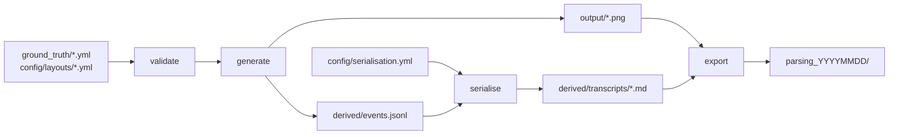

# Synthetic Document Parsing Corpus — Design

**Status:** approved design, not yet implemented
**Date:** 2026-08-17

---

## 1. Purpose

Generate a synthetic corpus of Australian business documents for benchmarking
**document parsing**, specifically full-page transcription, across competing
vision-language models and dedicated parsers.

Each document ships as a pristine page image paired with a canonical text
transcript. A model is asked to transcribe the page; its output is scored
against the transcript by normalised edit distance and character/word error
rate.

The corpus is an **evaluation set**, not training data. A few hundred pages,
every one of them inspectable, with label fidelity taking absolute priority
over volume.

### Ground truth is authored, not annotated

The transcript is produced by the renderer at the moment it draws the page, not
recovered from the page afterwards by OCR or by hand. Nothing is estimated and
nothing is labelled after the fact. This is the same principle the predecessor
repo established for field-level extraction truth, applied to a whole page.

## 2. Scope

**In scope**

- Full-page transcription ground truth for single-page business documents
- Pristine renders only
- Document types expressible in the inherited layout DSL: structured blocks,
  labelled pairs, and tables
- A scoring convention shipped alongside the corpus, and the prompt that
  assumes it

**Out of scope, deliberately**

| Excluded | Reason |
|---|---|
| Layout/region detection (polygons, region classes) | Not scored. Adding geometry now would create a second, half-maintained coordinate path for no consumer. |
| Table structure recognition (TEDS) | Not scored. Table semantics still reach the transcript as pipe tables. |
| Reading-order labels | Not scored as a separate output. Order is expressed by the transcript's sequence. |
| Degraded, photographed or scanned pages | Pristine only. See §9 for what this bounds the benchmark to claiming. |
| Multi-page documents and pagination | Every document is one page. |
| Flowing prose, multi-column body text | Outside what the inherited DSL expresses; corpus stays within structured business documents. |
| Information Extraction outputs | Belongs to the predecessor repo. See §10. |

## 3. Background: what this repo inherits

This repo starts clean but lifts the engine from `Synthetic_Doc_Generation`,
which built the field-level extraction benchmark. What crosses is roughly 5,400
lines of validated rendering machinery; what stays behind is roughly 2,700 lines
of extraction-specific projection.

**Crosses:**

| Module | Approx. lines | Why |
|---|---|---|
| `generators/layout_dsl/` | 3,970 | Schema validation, walk engine, all primitives, field binding, providers |
| `generators/common.py` | 722 | Font loading, fitted text, amount and ABN formatting |
| `generators/content_engine.py` | 300 | Content drawn from configured data pools |
| `layout_budgets.py`, `overflow_check.py`, `loader.py` | 291 | Fit-budget machinery the DSL depends on |
| `config/` architecture | — | YAML as single source of truth; layouts authored as DSL bodies; the real-business blocklist that screens invented names |

**Does not cross:** all of `exporters/` (CORD, DocILE, native, doc_refs,
`eval_projection`, `geometry.py`), `linking/`, `derive_outputs.py`,
`eval_set.py`, `score_extractions.ipynb`, `config/extraction_schema.yml`,
`config/export_config.yml`, the extraction ground-truth scripts,
`generators/degradation/`, and `rectify_camera_scan.py`.

### Rejected: a Typst rendering backend

A migration from Pillow to Typst had been under evaluation in the predecessor
repo, justified by visual realism. It is not adopted here, and the evaluation is
closed. Every argument for it fails against this brief:

- **Labels** are produced by instrumenting the DSL walk (§4), so Typst's ability
  to emit a PDF text layer buys nothing.
- **Corpus breadth** stays inside what the DSL already expresses. Typst's real
  advantage is flowing prose, column balancing and pagination, all out of scope.
- **Throughput** is irrelevant at a few hundred pages.
- **Realism** alone was already judged too thin to fund the migration.

This also removes the dependency-mirror availability question that gated the
Typst decision.

## 4. Architecture

### 4.1 Capture at draw time, in the primitives

A `TranscriptRecorder` hangs off `RenderContext` as `ctx.transcript`, following
the predecessor's opt-in recorder pattern. Each DSL primitive writes a structured
event at the point where it has resolved its content and is about to draw it.

**Why draw time rather than re-walking the block tree at export time.** A
re-walk would have to independently reproduce every content decision the
renderer makes: `when` conditionals, `suppress_if_equals`, `format_currency`
styles, `from_layout` static-string lookup, and `_date_is_redundant`'s
suppression of repeated dates in table rows. Two implementations of the same
semantics drift, and a transcription benchmark has no field-level sanity check
that would catch the drift. Capturing in the primitive means the code that
suppresses a block is the code that would have emitted its event, so divergence
stops being a bug to test for and becomes a state the design cannot represent.

**Why the primitive level rather than the pixel level.** `draw_fitted_left` and
friends know only a string and a box, which is not enough to rebuild a table.
Primitives know semantics: this is a cell at row 3, column 2, of a table with
these columns.

### 4.2 Event model

Flat, append-only, in walk order, with balanced open/close markers. The walk is
recursive, so appending from inside `draw_panel`, `draw_split` and `draw_table`
costs one line each, whereas a nested builder would require every primitive to
return shape it does not currently return. A flat stream rebuilds the tree in a
single pass.

```python
{"seq": int, "kind": str, "text": str | None, "meta": dict}
```

| Emitter | Event kinds |
|---|---|
| `banner` | `title` |
| `text`, `block` | `line` |
| `pair` | `pair` — meta: `label`, `value` |
| `table` | `table_open` (meta: `columns`), `row_open`, `cell` (meta: `row`, `col`, `column_key`, `header`), `row_close`, `table_close` |
| `panel` | `panel_open`, `panel_close` |
| `split` | `split_open`, `column_open`, `column_close`, `split_close` |
| `rule`, `spacer` | nothing |

**Captured string form:** the resolved value at the moment of drawing. After
field interpolation, after currency formatting, after `from_layout` lookup, and
**before wrapping**.

Wrapping is an artifact of font size and fit budget, not of content. A model
transcribing a wrapped address will normally rejoin it, and penalising that
would measure typography rather than reading. Pre-wrap capture also means the
same address on a narrow receipt and a wide invoice yields one truth string
rather than two.

**Two consequences worth stating explicitly.**

Suppression is free. `when` and `suppress_if_equals` gate the same code path
that emits, so a suppressed block leaves no event and no test is needed to keep
them in step.

`_date_is_redundant` blanks a repeated date in a table row, so the transcript
records the blank. This is correct, and it is the clearest evidence that parsing
truth is a genuinely different artifact from extraction truth rather than a
reformatting of it: extraction states the date, transcription states what the
page shows.

**Deliberate departures from the predecessor's `BoxRecorder`, which does not
cross (§3):** no duplicate-key guard, because repeated static text is normal and
expected on a page; and no geometry on events, because nothing scores it.

### 4.3 Serialisation

Events become a **deliberately restricted subset of Markdown**. Every parser and
VLM under test emits Markdown when asked to transcribe a page, so ground truth
in the same dialect removes a class of spurious penalty. Every Markdown feature
allowed is another convention a model can get wrong, so the subset is minimal.

| Event | Emits |
|---|---|
| `title` | `# ` heading |
| `line` | a plain paragraph line |
| `pair` | `Label: value` |
| `table_*` | pipe table with a header separator row |
| `panel`, `split` | nothing visible; structure only |
| `rule`, `spacer` | nothing |

**Emphasis is excluded on purpose.** The renderer knows exactly what is bold, so
emitting `**` is available and tempting. Bold detection is a typographic
judgement that models make inconsistently, and scoring it measures style
recognition rather than reading.

Three conventions carry real risk and are decided here:

- **Pair joining.** Strip any trailing colon and whitespace from the drawn
  label, then emit `label: value`. Deterministic, and avoids `Total:: $137.73`
  where the layout already draws a colon.
- **Split-column order.** Column by column in DSL order, left to right, never
  interleaved by vertical position. This is the one place competent models
  genuinely disagree: a two-column header with payer left and document metadata
  right is often read across visual rows instead. No normalisation can repair an
  ordering difference, so this convention must be stated in the prompt.
- **Wrapping.** Logical pre-wrap strings, per §4.2.

### 4.4 Serialisation policy lives in YAML

Per the house rule that YAML is the single source of truth, the convention is
configuration, not code. Every key is required. Omitting one is an error, never
a silent default, including keys whose value is a no-op.

```yaml
title_style: atx_h1
pair_separator: ": "
pair_strip_trailing_colon: true
table_style: pipe_with_header_rule
empty_cell_token: ""
split_order: column_major
block_separator: "\n\n"
emphasis: none
```

`emphasis: none` and `empty_cell_token: ""` are written out rather than omitted
so that reading this file alone answers what a transcript looks like, without
consulting Python.

## 5. Scoring

**Two metrics are reported, and neither is the real number on its own.**

**Primary, normalised.** Both prediction and truth pass through the same
normalisation, then normalised edit distance and character/word error rate are
computed. Normalisation applies Unicode NFKC, collapses all whitespace runs to a
single space, folds dashes and quotes to ASCII, and strips Markdown syntax
characters. It is therefore blind to wrapping, to table-markup dialect and to
pair layout. It measures **reading**.

**Secondary, strict.** The raw canonical form, scored as-is. It measures reading
plus convention adherence.

**Case is deliberately not folded.** Reading account names and identifiers with
correct case is legitimately part of transcription.

**Two boundaries keep this honest.** The generator emits one canonical form and
never normalises, because baking a normalisation policy into the corpus would
freeze it. Normalisation therefore lives in the scoring tool, so scoring policy
can change without regenerating a single image.

## 6. Pipeline



| Command | Does |
|---|---|
| `validate` | Ground truth, layout references, DSL bodies, fit budgets, and `serialisation.yml`. Fails before any work begins. |
| `generate` | Renders page images and captures `derived/events.jsonl` in the same pass |
| `serialise` | Events plus policy to `derived/transcripts/*.md`. Pure function; no rendering. |
| `export` | Assembles the dated deliverable directory |
| `preview` | Renders one document and prints its transcript beside the image path |

**Why `serialise` is a separate command.** Capture must happen during rendering,
but turning events into Markdown is a pure function of events and policy. §4.3
establishes that the convention is the risky, iterate-on-it part of this design,
so the split lets the policy change and every transcript re-emit in seconds
without re-rendering an image.

### 6.1 Export layout

```
parsing_<YYYYMMDD>/
  images/CASE001_invoice.png
  transcripts/CASE001_invoice.md
  manifest.jsonl        {image, transcript, doc_type, sha256}
  prompt.md             the prompt these transcripts assume
  serialisation.yml     copy of the policy that produced them
  README.md
```

Filenames are generic (`CASE001_invoice.png`, never `CASE001_cba_standard.png`)
so a model cannot infer the layout template before reading a pixel.

Two artifacts ship **with the data**, not only in the repo. The policy copy, so
a transcript remains interpretable independently of this checkout. And the
manifest with image hashes, which is the structural fix for the failure that bit
the predecessor project, where a run scored against the wrong-vintage ground
truth matched 22 of 165 filenames and still produced a plausible number. A
hashed manifest makes that mismatch impossible to score around rather than
merely detectable after the fact.

The prompt ships versioned alongside the corpus because prompt and ground truth
are a matched pair. If they drift, the benchmark silently measures the wrong
thing.

## 7. Corpus

**Target shape:** roughly 300 to 400 pages across 8 to 10 document types and 25
to 30 layouts, about 12 to 15 pages per layout.

**Rationale for breadth over depth.** The predecessor corpus used 55 cases per
type because field-level F1 needed per-field statistics. Transcription scores a
whole-page edit distance, so the variance that matters comes from layout
diversity, not from content repetition. Trading cases-per-type for
types-and-layouts buys more signal for the same page count.

**Existing entries carry across.** The 165 authored entries from the predecessor
repo (invoices, receipts, bank statements) bring validated ABN checksums,
correct GST arithmetic and screened business names at no cost, and give the repo
three working document types on day one. `transaction_links.yml` stays behind.

**Candidate additions**, all expressible with existing primitives: purchase
orders, remittance advice, payslips, utility bills, delivery dockets, quotes,
credit notes, statements of account.

### 7.1 Cost of a new document type

| Artifact | Work |
|---|---|
| `config/field_definitions.yml` | the type's field set |
| `config/layouts/<type>.yml` | one or more layouts, as DSL bodies |
| `ground_truth/<type>.yml` | N authored entries |
| `config/data_pools.yml` | any new content pools |
| Python | usually none |

That last row is the argument for inheriting the DSL. A contributor adds a
layout in YAML, runs `validate`, and receives a diagnostic naming the file and
key path if it is wrong. It is the difference between a repo a team can extend
and one only its author can.

## 8. Validation, error handling and testing

### 8.1 Fail-fast diagnostic contract

Every configuration validation error carries four elements: what is wrong, the
absolute file path and dotted key path, a concrete valid YAML example with
allowed values, and a one-line remediation. A stack trace alone is not a
diagnostic. This convention is currently implicit in the inherited
`layout_dsl/schema.py`; it is documented explicitly here because a new team will
not infer it.

### 8.2 The coverage invariant

§4.1 guarantees the transcript cannot diverge from the image for suppression or
content resolution. It does **not** guarantee coverage: a primitive added later,
or a new branch inside an existing one, can put text on the canvas without
emitting an event, producing a quietly incomplete transcript that nothing
downstream would notice.

Therefore every call that reaches the canvas is tagged with the `seq` of the
event that authorised it, and at page end the renderer asserts that no untagged
text was drawn. Wrapping reconciles because each drawn fragment carries its
logical event's `seq`, so one event covering three visual lines still balances.

**This runs on every `generate`, not only under pytest**, and fails the render
naming the offending primitive. A test catches only the case someone thought of;
a runtime invariant catches the primitive nobody has written yet, which is the
real risk in a repo a team extends.

### 8.3 Tests

Tests were to be **committed in this repo**, departing from the standing
local-only convention, because a team contributing document types must be able
to verify a change before pushing, CI needs something to run, and the serialiser
is precisely the code where a silent regression corrupts every label in the
corpus without anything downstream noticing.

**Reversed 2026-08-17:** with a single developer the first reason is void and the
second is moot until a CI provider exists (§11), so `tests/` is gitignored and
stays local, in line with the standing convention. The third reason is unchanged
and is why the tests below are still written and run — locally, before every
commit. Golden transcripts live under `tests/` and are therefore local too, which
means the readable regression net does not travel with the repo; reinstate
tracking alongside CI, or promote goldens to a tracked directory of their own,
whichever comes first.

`tests/` mirrors the source layout. Coverage floor 80%.

| Layer | Asserts |
|---|---|
| Per-primitive | A block plus context yields an exact event sequence |
| Serialiser | An event stream yields exact Markdown: empty cells, split columns, pairs with and without a drawn colon |
| Golden files | One committed `.md` per layout; the readable regression net for the whole pipeline |
| Diagnostics | Every fail-fast path carries all four elements, via a shared `assert_diagnostic_error` helper |
| Determinism | Same seed yields byte-identical images and transcripts |

### 8.4 CI

`ruff check`, `ruff format --check`, `mypy`, `pytest --cov`, and
`pipeline validate` as its own job, since a malformed layout YAML is the
likeliest contribution error and catching it requires no render. Rendering in CI
is limited to a fixed sample compared against golden files.

Per §8.3's reversal, the `pytest --cov` and golden-file jobs presuppose a tracked
`tests/` and cannot run until it is reinstated. `ruff`, `mypy` and
`pipeline validate` are unaffected and are what a CI provider would run first.

### 8.5 Contribution path

Add a layout in YAML, run `validate`, run `generate --type X`, inspect the page
against its transcript via `preview`, refresh the golden file locally, commit the
YAML. (Restore the PR step if the repo gains contributors — see §8.3.) The
inspection step is not optional: a transcription corpus's correctness is
ultimately visual, and there is no field-level check that would catch a bad
layout.

### 8.6 What no test can cover

Tests can prove the transcript matches what was drawn. They cannot prove the
**convention is fair** to models. That is empirical.

Before freezing the corpus, run two or three parsers over a sample and inspect
where they lose points, separating genuine reading errors from convention
mismatches. If a model reads a page perfectly and still scores badly, the
convention is wrong, and §4.4's policy file is where it is fixed, without
regenerating an image. This is a budgeted calibration pass, not something to
discover after the corpus ships.

**Decided 2026-08-18 — the four systems.** Two prompted VLMs and two dedicated
parsers:

| System | Kind | Reads `prompt.md`? |
|---|---|---|
| `gemma-4-12B-it-qat-w4a16-ct` | VLM, prompted, 4-bit QAT | Yes |
| `InternVL3.5-8B` | VLM, prompted | Yes |
| Docling | Document → Markdown parser | No |
| MinerU | Document → Markdown parser | No |

The split is the point. A prompted VLM tests whether `prompt.md` **communicates**
the convention — split-column order, one H1 per page, no emphasis. A dedicated
parser cannot be told the convention at all: it emits whatever its authors chose,
so every mismatch it produces is a pure signal about whether §4.4's convention is
idiomatic Markdown rather than an arbitrary house style. Two VLMs from different
families, rather than two of one, for the same reason — the pass is looking for
convention *disagreement*, not a leaderboard.

Three things shape how the results are read:

- The invoices and bank statements render at 1800–1900 × 3508 px. A pipeline
  that downscales hard produces reading errors that read as convention
  mismatches; confirm the input resolution before trusting any number.
- The receipts are thermal slips, 310–440 px wide and as short as 472 px. They
  behave nothing like the full-page documents on either axis, so sample across
  all three document types rather than taking the first N cases.
- The Gemma entry is a 4-bit quantised (QAT W4A16) checkpoint. Quantisation
  costs character-level fidelity before it costs anything else — transposed
  digits in an ABN or an amount — which is exactly the failure this pass must
  not misfile as a convention mismatch. Where that model alone loses points on
  a string the other three read correctly, suspect the checkpoint, not
  `serialisation.yml`.

VLM inference runs on the remote GPU host, never locally.

## 9. Stated limitation

A pristine-only corpus bounds what the benchmark can claim to parsing accuracy
on **clean renders**, not on photographed or scanned input. This is a coherent
benchmark; it simply wants stating, rather than being read as general
document-parsing accuracy.

## 10. Repository

```
config/     generation_config.yml, field_definitions.yml,
            serialisation.yml, data_pools.yml, layouts/*.yml
generators/ layout_dsl/, common.py, content_engine.py,
            transcript.py, serialise.py, pipeline.py
ground_truth/*.yml
tests/      local only, gitignored (§8.3)
docs/  README.md  LICENSE  environment.yml
CLAUDE.md   local only, gitignored (§10)
```

`CLAUDE.md` was to be **tracked** in this repo, unlike in the predecessor, so
every contributor's agent would share the house rules. **Reversed 2026-08-17:**
while this is a single-developer repo there is no second agent to share with, so
`CLAUDE.md` is gitignored and stays local. Reinstate if the repo gains
contributors — at which point §8.3's committed-tests rationale also strengthens.

### 10.1 Environment

Conda environment `docparse`, named in both `README.md` and `CLAUDE.md`.

```
Pillow      PyYAML      typer      rich      Faker
```

Five pure-Python packages. `numpy` and `opencv` were used only by the
degradation module and leave with it, taking the `numpy <= 2.4` cap with them,
which existed only because numba arrived via `augraphy`. The predecessor's
mandatory `scripts/post_install.sh` disappears entirely: it existed solely
because `augraphy` declares GUI OpenCV as a hard dependency and displaces the
pinned headless build.

A plain `conda env create -f environment.yml` provisions this repo with no
post-install step, which matters for a team that may pull through a restricted
mirror. All five packages are under permissive licenses; confirm at the point
versions are pinned and record the result in the repo, since this corpus is
shared.

### 10.2 Code conventions

Python 3.12, line length 108, `pathlib.Path` for all paths, Google-style
docstrings, `ruff` and `mypy` clean. Exceptions raised inside `except` blocks
use `from err` or `from None`.

## 11. Open items

| Item | Blocked on |
|---|---|
| `LICENSE` contents | Whether the corpus stays internal to the new team or goes wider |
| CI provider | Where the repo is hosted |
| Final document-type list and per-type counts | Confirmation against §7's target shape |
