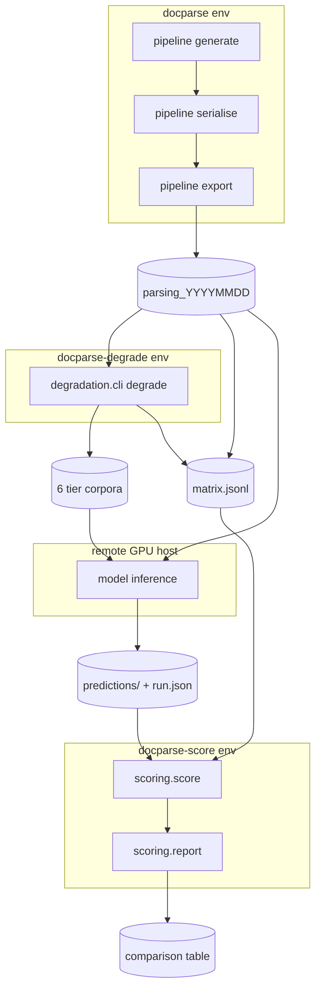

# Degradation Matrix and Text Scoring — Design

**Date:** 2026-08-25
**Status:** approved design, not yet planned
**Scope:** subsystems C and D-text of the four identified on 2026-08-25.

---

## 1. Purpose

Compare competing document-parsing models — currently `gemma-4-12B-it-qat-w4a16-ct`,
`InternVL3.5-8B` and `docling` — on this corpus, for an **internal deployment
choice**. Not a public leaderboard, not an adversarial vendor evaluation.

The brief was "test the Document Parsing abilities of competing models". That term
is contested; see `docs/research/2026-08-25-what-document-parsing-means.md`. The
agreed reading is the research sense — layout, tables, reading order and text — but
scored only on **what every entrant can emit**, since VLMs cannot produce bounding
boxes and would be disqualified by construction.

This spec covers the first increment: promote degradation to a first-class axis,
and build text scoring. It produces a real model comparison using machinery that
already exists, and proves the scoring harness before labels are built that depend
on it.

## 2. Scope

**In scope**

- `pipeline degrade` driven by YAML rather than a hand-run shell script.
- `matrix.jsonl` tying the clean corpus and its degraded tiers into one set.
- A `scoring/` package: normalisation, text metrics, corpus and prediction
  verification, per-page scoring, and aggregation.
- `config/scoring.yml` as the single source of truth for normalisation.

**Explicitly out of scope** (each is its own later spec)

| | Deferred subsystem |
|---|---|
| A | Ground-truth emission — geometry on events, block IDs, order index, table HTML |
| B | Structural realism — side-by-side vendor/payer invoice blocks, `colspan`/`rowspan`, spanning headers |
| — | TEDS and reading-order metrics (they need A) |
| — | Local model inference; inference runs on the remote GPU host only |
| — | The pre-existing coverage shortfall (78% against an 80% floor), which predates this work |

Subsystem B is worth recording as the next most valuable: invoices currently
contain **no genuine side-by-side content at all** — the only two `split` blocks in
`config/layouts/invoices.yml` have an empty left column and exist to right-align
totals. Vendor-left/payer-right is the construct the design doc names as the one
convention competent models genuinely disagree on, and it occurs in real Australian
tax invoices.

## 3. A recorded reversal

`README.md` states:

> "Scoring, parser runners and the calibration-pass analysis live in a separate
> repository. The interface between them is the exported corpus directory, not
> shared code — which is why this repository has no scoring dependency and its
> environment carries no parser."

This spec reverses the first clause and **preserves the second**. Scoring moves
into this repository, but:

- it lives in a top-level `scoring/` package, never inside `generators/`;
- it runs in its own environment, `docparse-score`, declared by
  `environment-score.yml`;
- `docparse` gains no dependency whatsoever, and `tests/test_env.py`'s guard
  against numpy/opencv/augraphy in `environment.yml` stays exactly as it is;
- **`scoring/` must not import `generators/`.** It reads an exported corpus
  directory and nothing else, so the "interface is the directory" principle holds
  even inside one repository. This is enforced by a test, not by convention.

The reason for the reversal: with an internal comparison there is one operator, and
a second repository is coordination overhead with no compensating isolation. The
isolation that mattered — no parser in the generator's environment — is kept by
package and environment boundaries instead.

## 4. Architecture



Three environments, three responsibilities, and the artifacts between them are
directories on disk — never shared Python.

## 5. Subsystem C — the corpus matrix

### 5.1 Operator intent moves into YAML

`config/degradation.yml` already declares the six tiers (`scan` and `photo` ×
`light`/`moderate`/`heavy`). It gains one required block:

```yaml
corpus:
  document_types: [bank_statements, receipts, invoices]
  families: [scan, photo]
```

Both keys are **required**. A missing key is a fail-fast error, not a silent
default, per the house rule. Reading `config/degradation.yml` alone must answer
"what does a full run produce?"

All three document types are degraded despite receipts being saturated on clean
pages. Creating headroom where clean pages have none is precisely what the
degradation axis is for.

### 5.2 Output lands with the generated data

`--out` currently defaults to the working directory. It defaults to the configured
`exports_dir` instead — the same correction already applied to `export`, for the
same reason: the tiers are generated data and belong beside the rest of it, not in
whichever directory the command happened to be run from.

Tier directory naming is unchanged: `<corpus>_<family>-<severity>`, e.g.
`parsing_20260825_scan-light`.

### 5.3 `matrix.jsonl`

Written to `<exports_dir>/matrix.jsonl`. One row per corpus, the clean corpus
included:

```json
{"corpus": "parsing_20260825", "family": "clean", "severity": "none", "pages": 165, "doc_types": ["bank_statements", "invoices", "receipts"], "manifest_sha256": "…"}
{"corpus": "parsing_20260825_scan-light", "family": "scan", "severity": "light", "pages": 165, "doc_types": ["bank_statements", "invoices", "receipts"], "manifest_sha256": "…"}
```

`manifest_sha256` is the hash of that corpus's `manifest.jsonl` file. The per-image
hashes already live inside it; hashing the manifest ties a matrix row to an exact
vintage with a single value.

The clean row is not optional. Without a clean baseline the comparison cannot
separate "this model is weak" from "degradation hurt it".

### 5.4 Sizing

Three document types × six tiers ≈ 990 degraded pages ≈ 900 MB of JPEG, roughly
30–60 minutes of Augraphy on one machine, one-off. No change to the clean corpus,
which stays byte-identical.

## 6. Subsystem D — text scoring

### 6.1 Package layout

```
scoring/
  __init__.py
  normalise.py     policy-driven text normalisation
  metrics.py       edit distance, CER, WER
  corpus.py        load and verify an exported corpus
  predictions.py   load and verify a prediction set
  score.py         CLI — one JSONL row per page
  report.py        CLI — aggregate rows into a comparison
```

`environment-score.yml` declares `docparse-score`: python 3.12, `pyyaml`, `typer`,
`rich`, `rapidfuzz`, plus `pytest`, `pytest-cov`, `ruff`, `mypy`. No torch, no
numpy, no parser.

### 6.2 The prediction contract

```
predictions/<model_id>/<corpus_name>/CASE001_bank_statements.md
                                     …
                                     run.json
```

Pairing is by **stem equality** with the corpus transcript. There is no mapping
file, because a mapping file is a thing that can drift.

`run.json` carries provenance, every key required:

```json
{
  "model_id": "gemma-4-12B-it-qat-w4a16-ct",
  "model_revision": "…",
  "prompt_sha256": "…",
  "corpus": "parsing_20260825_scan-light",
  "corpus_manifest_sha256": "…",
  "generated_at": "2026-08-26T09:14:03Z",
  "host": "…"
}
```

`corpus_manifest_sha256` is recorded **by the runner, on the remote host**.
Verifying local images proves the local copy is intact; it does not prove the
remote box scored the same vintage. Recording the hash on the far side and
checking it here closes a gap that is currently invisible.

Three rules:

- **A missing prediction file is an error, not a skip.** Scoring 160 of 165 pages
  and reporting the mean silently flatters the model that failed to answer.
  `--allow-missing` downgrades this to a row with `prediction_present: false` and
  `null` distances, so the absence is carried in the data rather than reported as
  a footnote, and `report` surfaces it as a column.
- **An empty prediction is a legitimate value**, scored as a total miss. "Absent"
  and "present but empty" are different events; the second is a real model
  behaviour that belongs in the numbers.
- **A prompt hash mismatch is fatal.** Prompt and transcripts are a matched pair.

### 6.3 `config/scoring.yml`

```yaml
normalisation:
  unicode_form: NFKC
  collapse_whitespace: true
  fold_dashes: true
  fold_quotes: true
  strip_markdown: true
  fold_case: false

reporting:
  degenerate_length_multiple: 3.0
  percentiles: [50, 90, 100]
```

Every key required. `fold_case: false` is written out rather than omitted,
following the same rule that keeps `emphasis: none` explicit in
`config/serialisation.yml` — reading the file alone must answer what the metric
does.

The corpus README currently states this policy as English prose inside
`generators/export.py`'s f-string. That prose is generated from this file instead,
so the shipped description and the scorer cannot disagree about what "normalised"
means.

### 6.4 Scoring and aggregation are separate commands

The same split as `generate` and `serialise`: capture once, interpret many times.

```bash
python -m scoring.score  --matrix <exports>/matrix.jsonl \
                         --predictions-root predictions/ --out rows.jsonl
python -m scoring.score  --corpus <dir> --predictions <dir> --out rows.jsonl
python -m scoring.report --rows rows.jsonl --group-by model,doc_type,family,severity
```

`report` emits Markdown by default, for a human reader; `--format csv` is
available for further analysis.

`score` emits one row per (model, corpus, page):

```json
{"model": "…", "corpus": "…", "case_id": "CASE001", "doc_type": "bank_statements",
 "family": "scan", "severity": "light",
 "ref_chars": 2393, "pred_chars": 2401, "prediction_present": true, "verified": true,
 "strict_edit_distance": 118, "strict_cer": 0.0493,
 "normalised_edit_distance": 41, "normalised_cer": 0.0171, "normalised_wer": 0.0402,
 "degenerate": false}
```

Every distance field is `null` when `prediction_present` is `false`. `verified`
records whether the corpus hashes were checked for this row, so a result produced
with `--skip-verify` can never be mistaken for one produced without it.

Re-slicing the comparison then costs seconds instead of re-scoring 1,155 pages.

### 6.5 Reporting is median-first

CER is `edit_distance / len(reference)` and is unbounded above, so a single runaway
page can dominate a mean; equally, a mean can hide two catastrophic failures behind
163 good pages. Both failure modes are attested in the calibration notes in
`make_degraded_statements.sh`: `gemma-4-12B` ran "away to 128,768 characters on two
pages and could not complete them at all", while `InternVL3.5-8B` omitted content
entirely.

So `report` emits, per group: median, p90, worst case, mean, and a **degenerate
count** — pages where `pred_chars > degenerate_length_multiple × ref_chars`.
Degenerate pages are counted, reported, and still included in the distribution;
they are never dropped.

Groups are model × doc_type × family × severity. The doc_type split matters
specifically because receipts are saturated on clean pages.

## 7. Error handling

Fail-fast at startup, before any scoring begins, with the four-element diagnostic
(what / where / expected / recover). Seven guards:

| # | Condition | Notes |
|---|---|---|
| 1 | Corpus directory has no `manifest.jsonl` | it is not an export |
| 2 | An image's sha256 differs from its manifest row | **verified by default** |
| 3 | `run.json` `prompt_sha256` ≠ the corpus's `prompt.md` hash | matched-pair violation |
| 4 | `run.json` `corpus_manifest_sha256` ≠ the matrix row | runner scored another vintage |
| 5 | A prediction file is missing | unless `--allow-missing` (see §6.2) |
| 6 | Any missing or invalid key in `config/scoring.yml` | including a `null` where a bool is required |
| 7 | A `matrix.jsonl` row names a corpus not on disk | |

Guard 2 deserves note: the shipped corpus README instructs a *human* to verify
hashes before scoring. The scorer doing it automatically is the entire point of
shipping the hashes. `--skip-verify` exists for fast iteration and sets
`verified: false` on every row it produces.

## 8. Testing

`tests/scoring/` mirroring the source layout. 80% coverage floor for the new
package.

- **Fixtures come from the real pipeline** into a tmp directory, not from
  hand-built corpora. `tests/layout_dsl/test_table_events.py` already makes this
  argument: a fixture drifts from the corpus, and then tests pass against
  something the generator no longer produces.
- Metric correctness is asserted against hand-computed values on short strings,
  where the expected edit distance can be checked by eye.
- Each normalisation step is tested independently, **and** tested that disabling it
  changes the result — so no step can pass vacuously.
- Every fail-fast path asserts all four diagnostic elements through the existing
  `tests/helpers.py::assert_diagnostic_error`.
- Guards 2, 3 and 4 each get a "does it actually catch a real break" test, in the
  style of `test_the_leak_guard_actually_catches_a_leak`: plant a corrupted image,
  a wrong prompt and a wrong manifest hash, and assert each is rejected.
- One structural test asserts that no module under `scoring/` imports
  `generators`, keeping §3's boundary honest.

## 9. Success criteria

1. `python -m generators.degradation.cli degrade` with no flags produces six tier
   corpora and a `matrix.jsonl` under `exports_dir`, driven entirely by
   `config/degradation.yml`.
2. The clean corpus remains byte-identical; its manifest still verifies.
3. `scoring.score` refuses, with a four-element diagnostic, a prediction set built
   against the wrong prompt or the wrong corpus vintage.
4. `scoring.report` produces a model × doc_type × family × severity table carrying
   median, p90, worst case, mean and degenerate count.
5. A degraded tier separates at least two of the three models on at least one
   document type — i.e. the difficulty axis demonstrably produces headroom that
   clean pages did not.

Criterion 5 is the one that can fail on its merits rather than through a defect. If
all six tiers leave the models tied, the conclusion is that this corpus cannot
discriminate them and subsystem B (structural realism) becomes the necessary next
step rather than an optional one.

## 10. Open items

One item, and it is external rather than undecided:

- **Which model revisions** are in the comparison, and who runs inference on the
  remote host. The prediction contract is defined here (§6.2); producing
  predictions is not part of this spec, and nothing in the design depends on the
  answer.
