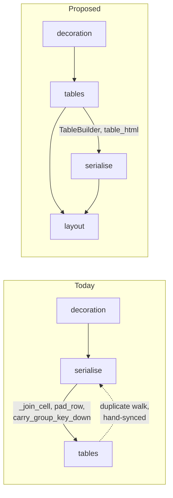

# HTML Tables as the Transcription Target — Design

**Date:** 2026-08-26
**Status:** Approved, not yet implemented
**Sequencing:** B1 (done) → **this** → B2 (colspan / rowspan / spanning headers)

---

## 1. Purpose

Change the corpus transcription target from Markdown-only to **Markdown with
HTML tables**. Every table in every transcript becomes an HTML `<table>`; all
other conventions are untouched.

Two reasons, in order of weight:

1. **Markdown pipe tables cannot express merged cells.** B2 — spanning headers,
   `colspan`, `rowspan` — is unimplementable against a pipe table at any cost.
   The format is the blocker, not the renderer.
2. **It is the field convention.** OmniDocBench, MinerU and Docling all score
   table content as HTML. Adopting it aligns our numbers with the benchmark our
   vocabulary already borrows (`layout_dets`, `category_type`, TEDS); inventing
   a third convention would not.

The HTML already exists. `generators/tables.py` has produced it for the export
since the layout ground truth landed, so this is a change of *which projection
the transcript uses*, not new rendering.

## 2. Decisions taken

Recorded because each closed off a cheaper-looking option:

| Decision | Chosen | Rejected, and why |
|---|---|---|
| Scope of the change | **Syntax only.** `cell_sub_line_join`, `cell_newline_join` and `headerless_table` keep their current values and meanings. | Lifting the single-line-cell constraint at the same time (`<br>` in cells, dropping `<thead>`) changes what a model must produce in three ways at once, making any score delta unattributable. |
| Old pipe path | **Deleted.** `table_style` accepts only `html`. | Keeping `pipe_with_header_rule` as a second YAML choice doubles the tested surface while `prompt.md` can only teach one style — the pair drifts silently. |
| `tables/*.html` in the export | **Kept.** | Dropping it forces every TEDS consumer to write a transcript-splitting step, which is non-trivial on the 14 multi-table pages. The duplication cannot drift (§4). |
| Module boundary | **Flip the dependency; no new module.** | A separate `table_model.py` would leave `tables.py` a ~15-line wrapper — two shallow modules where one deep one fits. |

## 3. The fact this design rests on

`serialise.serialise` and `tables.table_html` are **two independent walks of the
same event stream**. Both accumulate `rows: list[tuple[list[str], bool]]` across
`table_open` / `row_open` / `cell` / `cell_sub_line` / `row_close` /
`table_close`. Both call `_join_cell`. Both apply `cell_sub_line_join` and
`strip_decoration_run` to sub-lines. `generators/tables.py:112` says so outright:

> Mirrors `serialise.py`'s `cell_sub_line` handling exactly.

A comment is the only thing holding them in agreement.

Today that duplication is survivable because the two walks emit *different
syntaxes*, so divergence is invisible and mostly harmless. After this change
they must emit **byte-identical HTML** — the transcript's table and
`tables/{stem}.html` are the same bytes or the corpus contradicts itself. Two
hand-synced walks are exactly how that stops being true, and B2 would then add
merged-cell logic to both.

So the format change and the de-duplication are one piece of work, not two. Doing
the format change without it ships the hazard into the subsystem that most needs
not to have it.

## 4. Architecture

### 4.1 The dependency flips

`generators/tables.py` currently imports `RowWidthError`, `_join_cell`,
`carry_group_key_down` and `pad_row` **from** `serialise.py`, so `serialise`
cannot import `tables` — that is a cycle, and it is why the obvious "just call
`table_html`" move is unavailable.

Every one of those four helpers is used in `serialise.py` *only* inside the table
walk, as is its single `strip_decoration_run` call site (line 482, on cell
sub-lines). They move out wholesale, leaving no stragglers behind.



`tables.py` becomes the owner of everything about turning captured table events
into a table: the state machine, the cell helpers, and the HTML renderer it
already holds. `serialise.py` becomes a consumer. One dependency edge is deleted
rather than a node added, and `export.py` and `layout.py` import sites do not
move.

`tables.py` takes the policy as an argument and never loads it, so
`load_serialisation_policy` staying in `serialise.py` introduces no cycle.

### 4.2 The shared interface

```python
class TableBuilder:
    """Accumulates one page's table events; yields rendered HTML at each close.

    The single implementation of the table walk. Both projections drive it with
    the same events in the same order, so they cannot disagree.
    """

    def feed(self, event: dict) -> str | None:
        """Consume one event. Returns the table's HTML on `table_close`, else None."""
```

Both callers become the same loop:

- `tables.table_html(events, policy)` collects every non-`None` return into a
  list, in walk order — its current contract, unchanged for `export.py` and
  `layout.py`.
- `serialise.serialise` feeds the same events during its own walk and appends
  each returned string to `blocks` at the point the table closed.

Placement therefore stays a property of the walk rather than of positional
splicing, and the transcript's table is byte-identical to `tables/{stem}.html`
**by construction** — one renderer, one input, called twice.

`serialise._render_table` (~55 lines) and `tables.table_html`'s walk both delete.

### 4.3 Errors

`SerialisationError` and `TableHtmlError` both stay. `layout.py:177` already
catches `TableHtmlError` around its table projection and is not disturbed. The
four existing `TableHtmlError` cases in the walk — unclosed table, unclosed row,
`row_close` without `row_open`, over-wide row — raise from `TableBuilder` with
their current messages and the four-element diagnostic shape.

## 5. Policy

`config/serialisation.yml`:

```yaml
# Tables become HTML tables: <thead> for the header row, <tbody> for the rest.
table_style: html
```

`serialise._ALLOWED["table_style"]` narrows to `("html",)`. An old policy file
then **fails at load** with the four-element diagnostic naming the file, the
dotted key, the allowed value and the fix — rather than silently emitting a
format `prompt.md` no longer teaches.

`headerless_table: empty_header_row` keeps its value and its meaning: a table
that drew no header on the page gets an empty `<thead>` row, never a promoted
first line item. `tables._render` already implements exactly this.

`cell_sub_line_join`, `cell_newline_join` and `empty_cell_token` are unchanged
(§2).

## 6. Prompt

`config/prompt.md` teaches pipe tables in four worked examples (lines 77-79,
93-96, 111-112) and ~6 prose references. All become HTML.

Every example cell value stays **invented** and is re-verified against the whole
corpus before shipping — not only the values that change. The prompt ships with
the data and is read by the systems being scored; a real value in an example
hands a model an answer it was supposed to read off the page.

`tests/test_prompt.py` follows:

- `test_the_prompt_asks_for_the_table_style_the_policy_emits` asserts `html`.
- `_PROMPT_COVERAGE["table_style"]` maps to a phrase that exists in the rewritten
  prompt; `"header separator row"` will not.

## 7. The manifest gap this change exposes

`manifest_record` hashes **only the image**, deliberately — "the image is what a
model reads" (design §6.1). The consequence for this change is specific and bad:

> A corpus re-serialised into HTML tables carries **byte-identical hashes** to
> the pipe-table vintage, because no image moved.

The §6.1 guard exists to make wrong-vintage scoring *impossible* rather than
merely detectable. Against a serialisation-policy change it is blind: a scorer
holding predictions against the old transcripts verifies every hash successfully
and scores garbage. The export ships `serialisation.yml`, so the difference is
discoverable — but nothing forces the check, which is the distinction §6.1 was
written about.

**Add `transcript_sha256` to every manifest row.** A handful of lines in
`manifest_record`; closes the hole for this change and for every future
serialisation-policy change. The README's "Verify before you score" section gains
the transcript hash alongside the image hash.

## 8. Testing

| Area | What is asserted |
|---|---|
| `TableBuilder` | The walk directly: unclosed table, unclosed row, `row_close` without `row_open`, over-wide row. Diagnostics keep the four-element shape (`assert_diagnostic_error`). |
| **Identity** | For a page with a table, the transcript's embedded `<table>` is byte-identical to that page's `tables/{stem}.html`. This is the invariant the refactor exists to guarantee; it is the one test that would fail if the walks were ever re-duplicated. |
| Multi-table pages | The 14 two-table pages place both tables at the right points in the transcript, in walk order. |
| `tables.table_html` | Its four existing `TableHtmlError` cases still raise identically — the contract `export.py` and `layout.py` depend on. |
| Policy | `table_style: pipe_with_header_rule` now fails validation with a diagnostic naming file, key, allowed value and fix. |
| Headerless tables | A receipt layout with `header: false` still emits an empty `<thead>` row, not a promoted line item. |
| Determinism | `test_the_same_input_renders_byte_identical_images` unaffected — no pixel moves. |

### 8.1 The leak guard must be re-taught, not merely updated

`test_no_prompt_example_leaks_corpus_content` parses **pipe tables**: it splits
lines on `|` and exempts the first pipe row as the header. Given
`<tr><td>26/11/2019</td>...`, no line starts with `|`, so it falls through to the
plain-text branch and tests the token `<td>26/11/2019</td>` — a string that
appears in no transcript.

**It would pass vacuously on a genuine leak.** CLAUDE.md names this failure
directly: a regex that silently matches nothing is worse than no test at all.

Teaching it HTML makes it *stricter* than today. `<th>` and `<td>` mark header
and value cells explicitly, replacing the positional "first row is the header"
heuristic — a header cell is exempt because it is a `<th>`, not because of where
it sits. `test_the_leak_guard_actually_catches_a_leak` must be confirmed to fail
on a deliberate HTML leak before the guard is trusted.

## 9. Corpus impact

- **No image moves.** `regenerate_bank_statements.sh` and the determinism test
  are untouched. This is a `serialise` + `export` change.
- **All 177 transcripts re-emit in seconds.** Exactly the property the
  three-stage split was designed for: the transcription convention is the risky
  part of the design, so it can change without re-rendering a pixel.
- **Predictions scored against pipe-table transcripts are invalidated.** Images
  are unaffected, so re-scoring needs no new inference — only re-running the
  scorer against the new transcripts.
- **~1.46x tokens on table content**, per the sprint estimate. Worth restating
  when reporting any length-sensitive metric across the boundary.
- The scoring repository needs its table parser updated. Out of scope here; the
  interface is the exported corpus, not shared code.

## 10. Out of scope

- **B2** — `colspan`, `rowspan`, spanning headers. This design's value is that it
  leaves exactly one place to add them.
- Lifting the single-line-cell constraint (§2).
- Any change to normalisation, emphasis, or non-table conventions.
- The scoring repository's parser.

## 11. References

- `docs/standups/2026-08-26-sprint-summary.md` — sequencing, token estimate
- `docs/superpowers/specs/2026-08-26-layout-and-structure-ground-truth-design.md`
  — §5 table structure, the HTML projection this reuses
- `docs/superpowers/specs/2026-08-26-cell-aligned-table-metric-design.md`
- `docs/specs/2026-08-17-document-parsing-corpus-design.md` — §6.1 manifest
  hashing, the guard §7 extends
