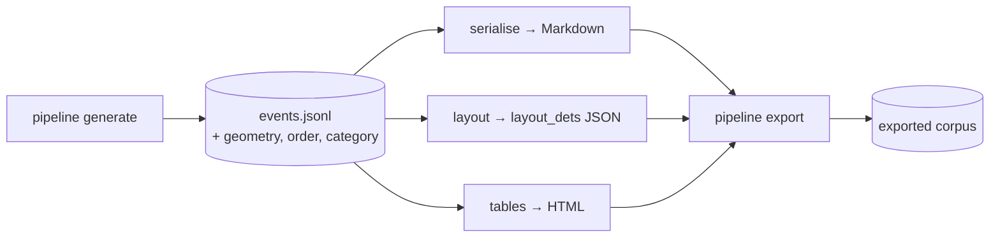

# Layout and Structure Ground Truth — Design

**Date:** 2026-08-26
**Status:** design, not yet planned
**Scope:** subsystem A of the four identified on 2026-08-25.
**Predecessor:** `docs/superpowers/specs/2026-08-25-degradation-matrix-and-scoring-design.md`
(subsystems C and D-text, merged as `2eed28a..3ee37a6`).

---

## 1. Purpose

Emit the three ground-truth labels this corpus computes and discards — element
boxes with classes, reading order, and table structure — so it can score
**research-sense document parsing**, not text alone.

`docs/research/2026-08-25-what-document-parsing-means.md` establishes that the
field means layout analysis plus recognition of text, tables, formulas and
figures, plus reading order, emitted as Markdown or JSON. This corpus currently
implements the end-to-end text track and nothing else. This spec closes that gap.

**Vocabulary is aligned to OmniDocBench deliberately.** Other teams reference it
in standups, so shared category names and annotation shape lower the cost of a
conversation even where the numbers are not comparable. §3 states precisely where
alignment holds and where it cannot.

## 2. The fact this design rests on

**The geometry is already in scope at every `emit()` call site.** Not computed
elsewhere, not recoverable only by re-walking — sitting in the local variables of
the line that creates the event:

- `ctx.region.x` and `ctx.region.width` give the left and right edges
  (`Region` carries both, plus a `.right` property).
- `y` is the parameter every primitive receives from `render_blocks`.
- The height is the primitive's own return delta. `draw_text_block` emits at one
  line and returns `y + line_advance(...)` a few lines later.

So the box for any element is `(region.x, y, region.right, y_after)` at the moment
the event is created. This subsystem adds a field to an existing call; it does not
build a coordinate system.

`§4.2` of the original design recorded the opposite decision — "no geometry on
events, because nothing scores it." That reasoning was correct when written and is
now obsolete: there is a consumer. This spec is that reversal, recorded.

## 3. OmniDocBench alignment

### 3.1 What we adopt verbatim

The annotation object and its field names, from the OmniDocBench schema:

| Field | Meaning | Our source |
|---|---|---|
| `category_type` | element class | derived from the primitive that drew it (§3.3) |
| `poly` | 8 coordinates: TL, TR, BR, BL as `(x,y)` pairs | the box at emit time |
| `anno_id` | unique id per box | the event's `seq` |
| `order` | numeric reading order | a block-level index over content events |
| `text` | the element's text | the event's existing `text` field |
| `html` | table structure | a new projection (§5) |
| `ignore` | exclude from evaluation | decoration (§3.4) |
| `line_with_spans` | nested span-level annotations | wrapped lines (§4) |
| `attribute` | key-value classification | doc type, layout id, tier |

Per-page annotations live in a `layout_dets` array, as OmniDocBench does.

**`poly`, not a bbox.** Every box this corpus produces is an axis-aligned
rectangle, so a four-point polygon is redundant — and we emit it anyway, because
matching the field shape is the entire point of aligning. Conversion is
`[x0,y0, x1,y0, x1,y1, x0,y1]`.

### 3.2 What we cannot align, and will not pretend to

**We populate 3 of their 18 block categories and 1 of their 4 span categories.**
This corpus is three Australian business document types. It contains no figures,
no formulas, no captions, no headers or footers, no page numbers, no code blocks
and no references. The unused categories are not gaps to fill with invented
content; they are honest absences.

| Their category | Us |
|---|---|
| `title`, `text_block`, `table` | used |
| `text_span` | used |
| `figure`, `figure_caption`, `figure_footnote` | absent — no figures |
| `equation_isolated`, `equation_caption`, `equation_inline`, `equation_ignore` | absent — no formulas |
| `table_caption`, `table_footnote` | absent — our tables carry neither |
| `header`, `footer`, `page_number`, `page_footnote` | absent — single-page documents |
| `code_txt`, `code_txt_caption`, `reference` | absent |
| `abandon` | used, for decoration only (§3.4) |
| `footnote_mark` | absent |

**No formula track, therefore no composite score.** OmniDocBench's headline is
`((1 − text edit distance) × 100 + TEDS + CDM) / 3`. CDM is a formula metric and
this corpus has no formulas, so that number is not computable here. A three-way
average with one term missing is not the same statistic, and reporting one would
invite exactly the false comparison §8.3 of the research note warns about. We
report the per-task numbers and no composite.

### 3.3 Category mapping

Derived from the primitive, not authored per block — so a new layout cannot
mislabel its content, and the mapping is checkable at startup.

| Primitive | `category_type` | Note |
|---|---|---|
| `banner` | `title` | the bank mastheads |
| `text` with `title: true` | `title` | exactly one per page |
| `text`, `block` | `text_block` | |
| `pair` | `text_block` | a label/value line is text |
| `table` | `table` | one block per table, carrying `html` |
| `rule` with a `fill_char` | `abandon`, `ignore: true` | draws glyphs, contributes no content |
| `rule` without a fill char, `spacer` | none | no ink |
| `panel`, `split`, column markers | none | containers, not content |

**Table cells get no boxes.** OmniDocBench has no `table_cell` category and scores
tables by TEDS over the `html`, not by cell geometry. Emitting cell boxes would be
data no metric consumes. Cell structure is preserved where it is scored — in the
HTML.

### 3.4 Decoration becomes visible, without changing the transcript

`generators/decoration.py` records that a run of repeated glyphs is decoration and
is stripped from the transcript. Under this schema it gains a better home: emitted
as an `abandon` box with `ignore: true`, so the annotation states *there is ink
here that no metric should score* rather than staying silent about it.

This changes no transcript. The layout projection and the Markdown projection are
independent readings of the same event stream.

## 4. The block/span decision

Transcripts capture text **pre-wrap** — deliberately, because wrapping is an
artifact of font size and fit budget, not of content, and the same address on a
narrow receipt and a wide invoice must yield one truth string. But a box is
inherently **post-wrap**: it is where the ink landed.

OmniDocBench's schema resolves this rather than forcing a choice:

- The **block** carries the pre-wrap `text` and a `poly` spanning all its wrapped
  lines. This is what the transcript already records, unchanged.
- Each drawn line becomes a **`text_span`** inside `line_with_spans`, with its own
  `poly` and its own text.

So a two-line wrapped address is one `text_block` and two `text_span`s. Both
readings are true, neither is lossy, and the block-level text stays byte-identical
to what `serialise` emits today.

**This requires capturing the wrap.** `_draw_fitted_text` currently splits a string
across lines internally and returns only the advanced cursor. It must report the
lines it drew and their y-offsets. That is the one non-trivial renderer change in
this subsystem.

## 5. Table structure

A third projection over the same events, alongside `serialise`'s Markdown.

`cell` events already carry `row`, `col`, `column_key` and `header` — the
structure is captured; only the serialisation is missing. `scoring/` is a pure
function from events to text, and the same shape applies: events plus a convention
to HTML.

**HTML only; `latex` is left absent.** OmniDocBench provides both and its schema
marks both optional. TEDS is defined over the HTML tree; the LaTeX form would be
a second representation nothing here scores, and two statements of one structure
drift. Emit `latex` when something scores it.

**No `colspan` or `rowspan`.** The table primitive has no merged-cell concept, so
every table is a uniform grid and the attributes would be constant. Merged cells
are subsystem B; when they land, the HTML projection gains the attributes and TEDS
starts measuring something it cannot measure today.

## 6. Reading order

Events are already captured in walk order, and `seq` is that order. What is
missing is a **block-level** index: `seq` counts structural markers
(`panel_open`, `split_open`, `column_close`) that carry no content and must not
consume an ordinal.

`order` is therefore a separate counter, incremented only for events that produce
an annotation. Structural markers keep shaping the walk and receive no `order`.

**Column-major order is preserved.** `config/serialisation.yml`'s
`split_order: column_major` states that a two-column block reads down one column
then the other, never across visual rows. The walk already produces that order, so
`order` inherits it — and it is the one convention the design notes competent
models genuinely disagree on, which makes it the most valuable thing here to
score.

**The metric is deferred, not assumed.** Scoring reading order requires aligning a
prediction's blocks to reference blocks before sequences can be compared, and for
a Markdown-only prediction that alignment is the hard part. This spec produces the
labels; the metric belongs to the scoring spec that consumes them.

## 7. Architecture



**Three projections over one capture.** `serialise` is untouched — this adds
siblings, it does not modify the existing reading. That preserves the property the
original design bought with the generate/serialise split: a convention can change
and every artifact re-emit without re-rendering a page.

### 7.1 Event model change

Content events gain three fields; structural markers gain none:

```json
{"seq": 12, "kind": "line", "text": "Coastal Chartered Accountants",
 "meta": {...},
 "poly": [100, 340, 1800, 340, 1800, 388, 100, 388],
 "category_type": "text_block",
 "order": 4,
 "spans": [{"poly": [...], "text": "..."}]}
```

`spans` is the internal form; the export renders it as `line_with_spans`.

### 7.2 The box coverage invariant

`TranscriptDraw` already refuses any text draw the recorder has not authorised
with an `emit()`, and that invariant runs on every `generate` rather than only
under test — "a test catches the case someone thought of, a runtime invariant
catches the primitive nobody has written yet."

Geometry needs the same guarantee, and it is a different check: text coverage asks
*was this draw authorised*, box coverage asks *did every authorised content event
get a box*. At page end the recorder asserts that no event carrying a
`category_type` lacks a `poly`, and fails the run naming the offending `seq` and
kind.

Without it, a primitive added later emits an event with no geometry, the
annotation silently omits that element, and layout recall drops for a reason no
one can see.

### 7.3 Export

The corpus gains one artifact per page and one directory:

```
parsing_<YYYYMMDD>/
  images/            unchanged
  transcripts/       unchanged, byte-identical
  layout/CASE001_invoices.json     ← new: layout_dets
  tables/CASE001_invoices.html     ← new, when the page has a table
  manifest.jsonl     gains layout and tables paths per row
  ...
```

**Existing artifacts must stay byte-identical.** Adding fields to events changes
`events.jsonl`; it must change no pixel and no transcript. The plan verifies this
the way the decoration change was verified: regenerate, hash all 165 images and
all 165 transcripts, and require an exact match before the work is accepted.

## 8. What is scoreable, and by whom

The field is mixed — two VLMs (`gemma-4-12B-it-qat-w4a16-ct`,
`InternVL3.5-8B`) and one dedicated parser (`docling`). This was settled for the
text subsystem and the same constraint governs here.

| Task | VLMs | Parsers |
|---|---|---|
| Text | yes | yes |
| Table structure (TEDS) | yes — recoverable from a Markdown pipe table | yes |
| Reading order | yes — recoverable from block sequence | yes |
| **Layout detection (mAP)** | **no** — cannot emit boxes | yes |

Layout ground truth is emitted for every page regardless, and **reported
separately, for parsers only**. Scoring a VLM on a task it cannot express is not
a low score, it is a category error. One honest leaderboard covers the three tasks
every entrant can attempt.

## 9. Error handling

Fail-fast at startup with the four-element diagnostic (What / Where / Expected /
Recover), consistent with the rest of the repo:

1. A primitive emits a content event with no `poly` — the §7.2 invariant, at page
   end, naming the `seq` and kind.
2. A primitive has no entry in the §3.3 category map — at startup, listing the
   mapped primitives.
3. A `poly` falls outside the page bounds, or has non-positive width or height.
4. Two events claim the same `order`, or `order` has a gap.
5. A table block carries no `html`, or its HTML does not parse.

## 10. Testing

`tests/` mirrors source and is gitignored — written, run, never committed. 80%
floor for new code.

- **Fixtures come from the real pipeline**, not hand-built corpora, following
  `tests/layout_dsl/test_table_events.py`: a fixture drifts from the corpus and
  then tests pass against something the generator no longer produces.
- **Geometry is asserted against the drawn page**, not against itself. For a
  known case, crop the image to a claimed `poly` and assert the crop is not blank
  and that the surrounding margin is — a box that claims the wrong region fails.
  This is the analogue of the visual check §8.5 requires, made automatic.
- **The §7.2 invariant gets a "does it actually catch a break" test**: add a
  primitive that emits without a box and assert the run fails naming it. In the
  style of `test_the_leak_guard_actually_catches_a_leak`.
- **Byte-identity is a test, not a step**: 165 images and 165 transcripts unchanged.
- **Wrapping is tested at both levels**: a known wrapped field yields one block
  whose text matches the transcript and N spans whose boxes are disjoint and
  ordered top to bottom.
- **The category map is exhaustive over the primitive registry** — a new primitive
  fails the test until it is mapped.

## 11. Success criteria

1. `generate` emits `poly`, `category_type` and `order` for every content event,
   and the coverage invariant fails a run that omits one.
2. All 165 images and all 165 transcripts are byte-identical to the shipped
   vintage.
3. `export` writes a `layout/` JSON per page in OmniDocBench's `layout_dets`
   shape, and a `tables/` HTML per page that has a table.
4. A wrapped field produces one block plus N spans, with block text matching the
   transcript exactly.
5. Boxes verify against pixels: for a sample of pages, every claimed `poly`
   contains ink and no content ink falls outside every `poly`.
6. A team member who works in OmniDocBench's vocabulary can read our annotation
   file without a translation table.

Criterion 5 is the one that can fail on its merits. If boxes and ink disagree, the
geometry is wrong in a way no self-consistent test would reveal.

## 12. Out of scope

| | Deferred |
|---|---|
| B | Structural realism — side-by-side vendor/payer blocks, `colspan`/`rowspan`, spanning headers. Required before TEDS measures anything a uniform grid does not already tell you. |
| — | The layout, reading-order and table **metrics** (mAP, an order metric, TEDS) and their scorer. This spec produces labels; consuming them is the next increment. |
| — | `latex` table output, formula and figure categories, multi-page documents, `attribute` values beyond doc type / layout id / tier. |
| — | Re-exporting the shipped `parsing_20260825` vintage. New artifacts appear in the next export; the existing one stays as scored. |

## 13. Open items

- **The element-class taxonomy is fixed by §3.3, but `abandon` for decoration is a
  judgement call.** The alternative is to emit nothing, as today. Emitting it with
  `ignore: true` is more informative and costs nothing; it is called out here
  because it is the one place we annotate something no metric will read.
- **`attribute` contents.** Doc type, layout id and degradation tier are the
  obvious three. OmniDocBench carries nine bbox-level attribute labels; ours are
  not theirs, and inventing overlap would be worse than having fewer.

## 14. References

- OmniDocBench — [arXiv:2412.07626](https://arxiv.org/abs/2412.07626) ·
  [repo](https://github.com/opendatalab/OmniDocBench). Annotation schema
  (`layout_dets`, `category_type`, `poly`, `order`, `anno_id`, `ignore`,
  `line_with_spans`) taken from the repository documentation.
- TEDS — Zhong et al., [arXiv:1911.10683](https://arxiv.org/abs/1911.10683).
- `docs/research/2026-08-25-what-document-parsing-means.md` — why this subsystem
  is what "document parsing" means in the research sense.
